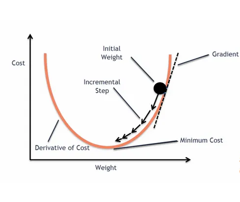

**Assignment By**

* Muhammad Raaid Khan
* Data Science and AI (Batch - 05)
* NED - CCEE

# <ins>Gradient Descent

*Gradient Descent is an optimization algorithm commonly used in machine learning and deep learning to minimize the loss function and improve model accuracy. The primary goal of gradient descent is to find the parameters (weights and biases) of a model that minimize the error between the predicted outputs and the actual outputs.*

## Types of Gradient Descent:

- **Batch Gradient Descent**: Uses the entire dataset to compute the gradient. It's accurate but can be computationally expensive for large datasets.
    
- **Stochastic Gradient Descent (SGD)**: Uses only a single randomly selected data point to compute the gradient. It's faster but may have more fluctuations in the convergence path.
    
- **Mini-batch Gradient Descent**: A compromise between Batch and Stochastic, it uses a small batch of data points to compute the gradient. It balances speed and accuracy and is commonly used in practice.

### Applications:

Gradient Descent is used in training various machine learning models, including linear regression, logistic regression, neural networks, and support vector machines, to name a few.

# <ins>Validation Set

*The validation set is a subset of the dataset that is not used for training the model but is used to evaluate its performance during the training process. It serves as an intermediary step between training and testing.*

The purpose of the validation set is to provide an unbiased evaluation of a model's fit on the training data, helping in:

1. **Hyperparameter Tuning**: Adjusting parameters such as learning rate, regularization factors, or the architecture of the model based on performance on the validation set.
    
2. **Preventing Over-fitting**: Monitoring the model's performance on the validation set to detect over-fitting, which occurs when the model performs well on the training data but poorly on new, unseen data.
    

# <ins>Validation Loss

*Validation loss is the error measured on the validation set. It provides insight into how well the model is generalizing to unseen data. The validation loss is calculated using the same loss function used during training but is applied to the validation data.*

## Example:

Let's say you have a dataset that you split into three parts: 60% for training, 20% for validation, and 20% for testing. During training, the model's performance is evaluated after each epoch (complete pass through the training data) using the validation set, and the validation loss is calculated. If the validation loss begins to increase while the training loss decreases, you might stop training early or adjust the model's complexity to avoid over-fitting.